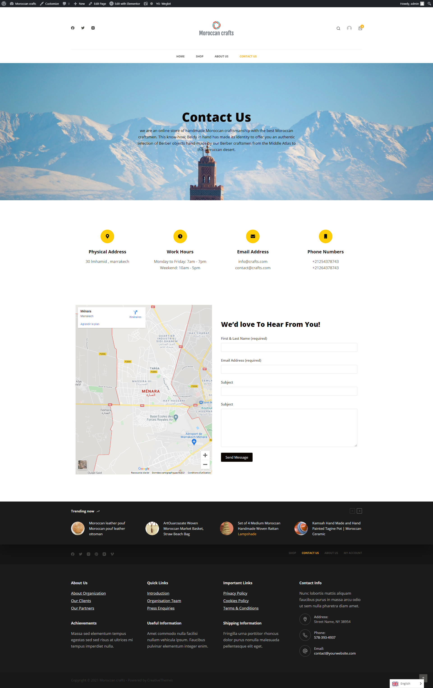

# ecommerce-wordpress

<h2>CONTEXT DU PROJET</h2>

Vous êtes amenés à creer votre site E-commerce avec WordPress et le plugin -WooCommerce-

​
<h2>Travail à faire : </h2>

Installer Wordpress après le téléchargement de son code source.

Créer la base de données qui sera utilisé par wordpress pour création de ses tables.

Créer des utilisateurs avec différent rôles.

Chercher et installer un thème E-commerce de votre choix compatible avec le plugin WooCommerce

Installer le plugin WooCommerce

Créer votre boutique en ligne:

Configurez des catégories et des produits(titre, image, prix)

ajouter des coupon de réduction

minimun 20 produits avec différentes variations ex produits en promo...

Créer des comptes utilisateurs 'clients' et 'administrateurs'

Ajoutez d’autres plugins pour faire

le marketing SEO

multilingue

RGPD (Règlement Général pour la Protection des Données).

Modalités pédagogiques Temporalité : 3 jours

Modalités de Travail : Individuel

Instruction:
1 - Installation du wordpress sur: https://wordpress.org/download/

2 - Création d'une base de donnée MYSQL nommé: ecomerce

3 - Installation de wordpress: localhost/ecomerce

4 - Configuration: Surname: admin, Password: 1995, status : Administateur

5 - Type du Projet: Woocommerce Website.

6 - Téléchargement du plugin ELEMENTOR PRO - Weglot - Yoast SEO - Woocommerce - Cookie Notice & Compliance for GDPR .

<h2>ScreanShots</h2>

<h3>logo</h3>

 

<h3>home</h3>

 

<h3>shop</h3>

 

<h3>about</h3>

 

<h3>contact</h3>
 
 

<h3>product simple</h3>

 

<h3>product variable</h3>

 

-- * Woocommerce: WooCommerce est la solution de commerce électronique open source la plus populaire au monde . Que vous lanciez une entreprise, que vous mettiez en ligne la vente au détail de briques et de mortier ou que vous développiez des sites pour des clients, utilisez WooCommerce pour un magasin qui allie puissamment contenu et commerce.

Créez de belles vitrines attrayantes avec des thèmes adaptés à votre marque et à votre secteur d'activité. Personnalisez les pages en quelques minutes à l' aide de blocs de produits modulaires . Présentez les produits physiques et numériques, les variations de produits, les configurations personnalisées, les téléchargements instantanés et les articles affiliés. Les réservations , les adhésions , les abonnements et les règles de tarification dynamique ne sont qu'une extension. Atteignez le sommet des résultats de recherche en tirant parti de l'avantage SEO de WordPress .

--
-- * weglot : Une meilleure façon de traduire votre site WordPress directement depuis le front-end, avec une prise en charge complète de WooCommerce, des thèmes complexes et des constructeurs de sites. Un plugin de traduction WordPress facile à utiliser pour changer * --

-- * Yoast SEO: Le plugin Yoast SEO permet à votre site de répondre facilement aux normes de référencement techniques les plus élevées. Il vous donne également les outils pour amener votre contenu aux normes les plus élevées de référencement et de lisibilité globale. Ici, nous allons discuter de la façon dont notre plugin vous aide à créer le meilleur site Web possible ! * --

-- * Cookie Notice & Compliance for GDPR / CCPA: L'avis sur les cookies fournit une bannière de site Web simple et personnalisable qui peut être utilisée pour aider votre site Web à se conformer à certaines exigences de consentement aux cookies en vertu de la loi sur les cookies de l'UE GDPR et des réglementations CCPA. * --

7 - Importer un Theme qui s'appel blocksy, demo: blocksy

8 - Edition du Demo avec ELEMENTOR PRO

9 - Creation des utilisateurs.

10 - Ajout des catégories et des produits (20 produits et 3 catégories).

11 - Activation du Plugin weglot et traduire les pages du Projet.

12 - Création des coupons codes (2 coupons).

13 - Recherche sur RGPD, sécurité d'un site web.

14 - Configuration du SEO.

15 - Ajout d'une méthode de payment.